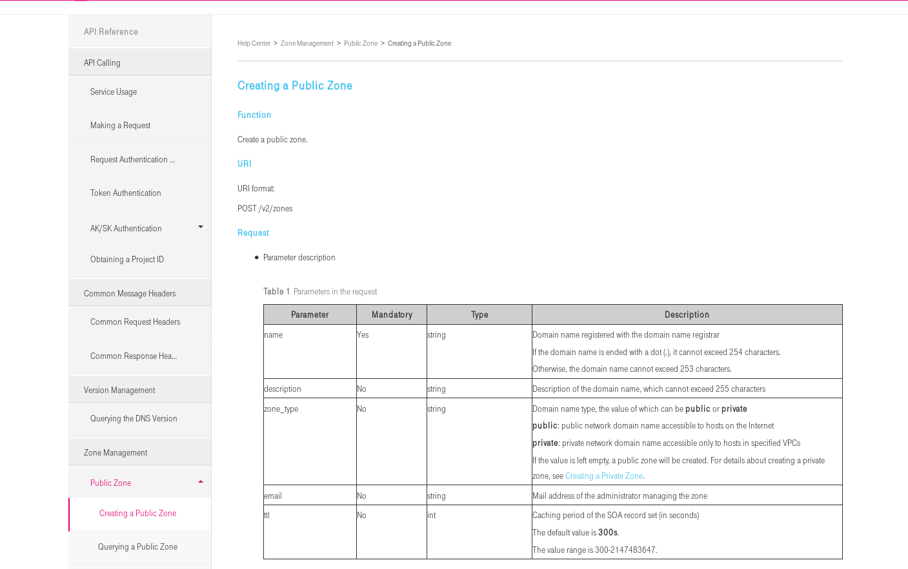

OTC DNS - the complete example
==============================

DNS services are provided by OTC since months. Now the complete stack
is reworked so we can take a closer look on API service.

.. image:: pictures/otc-dns.png

The service is located on the dashboard in the network services area.
There are 3 main features as you can see on the screen:

* Public Zones
* Private Zones
* PTR-Records

Private Zones and PTR-Records are completly new. If you have older 
implementation with setup reverse zones, please update to the new one.
A good thing: it's simple!

Documentation can you found at https://docs.otc.t-systems.com/en-us/dns_dld/index.html

Let's start to implement some DNS entries via API. We will do this with Ansible.

First of all we need connection to OTC. Use the :ref:`Connect_Cheat_Sheet`

It's a good idea to install openstack-client because ansible will use
the same os-client-config::

    git clone https://github.com/eumel8/ansible-otc.git
    cd ansible-otc/playbooks
    cp vars/secrets.yml  vars/_secrets.yml 

In _secrets.yml are only S3 credentials stored. You need to adjust *env.yml* 
with the used profile name in clouds.yml. Ignore the *_secrets.yml* settings

adjust account data here or in clouds.yml::

    USERNAME: "<username>"
    PASSWORD: "<password>"
    DOMAIN: "OTC-EU-DE-0000000000100000XXXX"
    PROJECT_NAME: "eu-de"

    EC2_ACCESS_KEY: "<obs access key>"
    EC2_SECRET_KEY: "<obs secret key>"
    EC2_URL: "https://obs.otc.t-systems.com"

    # endpoint urls
    IAM_AUTH_URL: "https://iam.{{ PROJECT_NAME }}.otc.t-systems.com/v3"
    AUTH_URL_ELB: "https://elb.{{ PROJECT_NAME }}.otc.t-systems.com/v1.0"
    AUTH_URL_ECS_CLOUD: "https://ecs.{{ PROJECT_NAME }}.otc.t-systems.com/v1"
    AUTH_URL_RDS: "https://rds.{{ PROJECT_NAME }}.otc.t-systems.com/rds/v1"

Service endpoint for DNS is provided by IAM, so it's not necessary to setup.

Imagine we have a dns.ini with the configuration of all resources of DNS:

.. image:: pictures/tenant-ini-dns.png

Formely the sections dnszones snd dnszonerecords were in tenant.ini file

**Public** zones are isolated on OTC. You can host your zones there but there 
is no registration service to catch new domains. This means you need to 
delegate your elsewhere registered domains to the public OTC server:

**ns1.open-telekom-cloud.com** and **ns2.open-telekom-cloud.com**

Before you need to configure your zone in OTC (see below) because the domain 
(and all sub-domain) are uniq bound to one tenant. If someone else has 
configured the domain, you need the service desk to clarify.

**Private zones** are only reachable in the selected VPC and with the resolver host **100.125.4.25**

**Reverse DNS** (PTR records) are only provided for public ip (EIP). The
ip address must assigned to your tenant to set the PTR record.

Related playbooks are *dns_ini.yml*, *dns_yml.yml* and *dns_json.yml*
All of them control the otc_dns role.

Lets start a virtual machine with a fixed private ip address and an allocated EIP::

    ansible-playbook tenant_ini.yml -e "ecs_name=ansible-test01"

In this play we setup a new DNS zone, make an A-Record for ECS, and
set PTR-Record (Reverse DNS)::

    ansible-playbook dns_ini.yml -e "zone_name=ansible.otc.telekomcloud99.com" -e "localaction=create"

    ansible-playbook dns_ini.yml -e "zone_name=ansible.otc.telekomcloud99.com" -e "ecs_name=ansible-test01" -e "localaction=ptrcreate"

Here we create zones and zonerecords. API works asynchron so if job
processing is slow you need to repeat the step if the zone is not
ready when zonerecords are added.

Tests::

    $ host -t A  ansible-test101.ansible.otc.telekomcloud2.com ns1.open-telekom-cloud.com
    Using domain server:
    Name: ns1.open-telekom-cloud.com
    Address: 46.29.103.61#53
    Aliases: 

    ansible-test101.ansible.otc.telekomcloud2.com has address 160.44.207.211

    $ host -t A 160.44.207.211  ns1.open-telekom-cloud.com
    Using domain server:
    Name: ns1.open-telekom-cloud.com
    Address: 46.29.103.61#53
    Aliases: 

    211.207.44.160.in-addr.arpa domain name pointer ansible-test101.ansible.otc.telekomcloud2.com.

    $ host  ansible-test101.ansible.internal.corp 100.125.4.25
    Using domain server:
    Name: 100.125.4.25
    Address: 100.125.4.25#53
    Aliases: 

    ansible-test101.ansible.internal.corp has address 192.168.0.101

Remove DNS reverse entry::

    ./grole otc_dns; ansible-playbook roles.yml -e "public_ip_address=160.44.207.211" -e "localaction=ptrdelete"

Migrate your complete zones automatically (required xfer permissions)

Private zone::

    ansible-playbook dns_ini.yml -e "config=ini" -e "localaction=transfer" -e "dns_server=192.168.0.1" -e "zone_name=ansible.internal.corp"" -e "zone_type=private" -e "zone_email=nobody@localhost" -e "zone_ttl=86400"

    ansible-playbook dns_ini.yml -e "zone_name=ansible.internal.corp" -e "vpc_name=ansible-vpc01" -e "localaction=create"

Public zone::

    ansible-playbook dns_ini.yml -e "config=ini" -e "localaction=transfer" -e "dns_server=192.168.0.1" -e "zone_name=example.com" -e "zone_type=public" -e "zone_email=nobody@localhost" -e "zone_ttl=86400"

    ansible-playbook dns_ini.yml -e "zone_name=example.com" -e "localaction=create"

End of PoC. Look at the `[other plays and roles] <https://github.com/eumel8/ansible-otc>`__ to interact with OTC API
